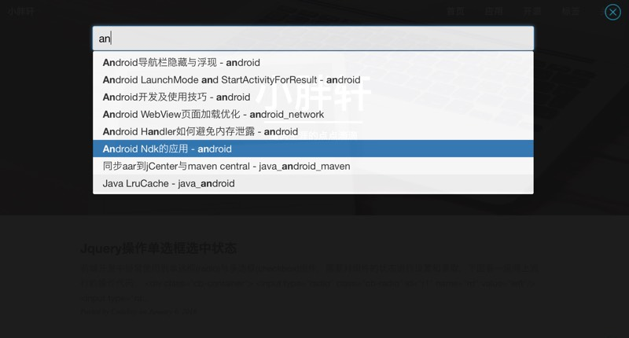

# Jekyll-Search

jekyll博客搜索插件

### 截图

也可以打开[https://codeboy.me](https://codeboy.me)查看效果

### 操作

1. 点击右下角图标进行搜索
2. 双击ctrl键进行搜索或关闭
3. 搜索页面点击右上角关闭按钮关闭搜索试图

### 加入步骤

1. 将search目录放至于博客根目录下，其中search目录结构如下:

		search
		├── cb-footer-add.html
		├── cb-search.json
		├── css
		│   └── cb-search.css
		├── img
		│   ├── cb-close.png
		│   └── cb-search.png
		└── js
		    ├── bootstrap3-typeahead.min.js
		    └── cb-search.js

2. 在 `_include/footer.html` 中的 `</footer>` 前加入 `cb-footer-add.html` 中的内容即可。 

### 注意事项

1. 需要事先引入**jquery**与**bootstrap3(js与css文件)**框架，如果没有的话，可以在`_include/footer.html` 中自行引入。
2. 默认联想8个，如果需要更多的话，请检索 `bootstrap3-typeahead.min.js` 中的**items:8**, 将**8**替换成自己需要的数值。

> 有任何问题何以发送邮件到app@codeboy.me进行交流。

